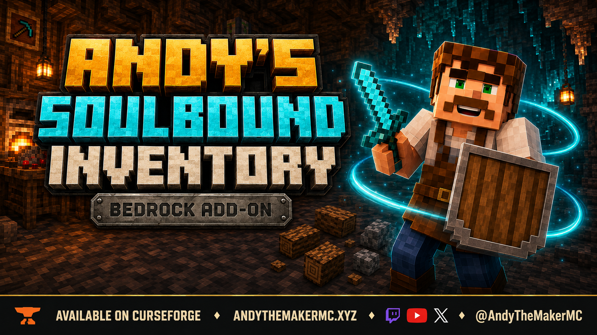
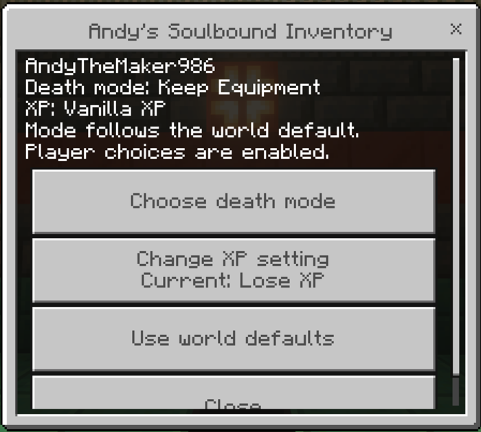
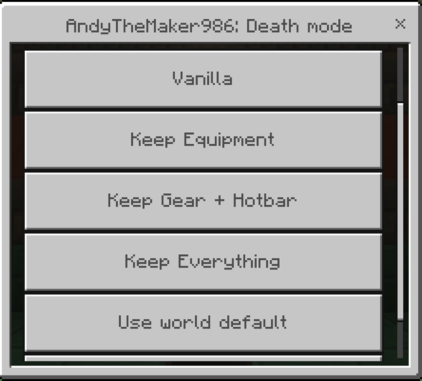
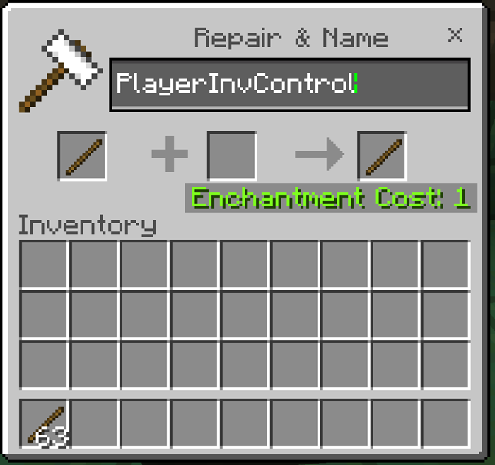
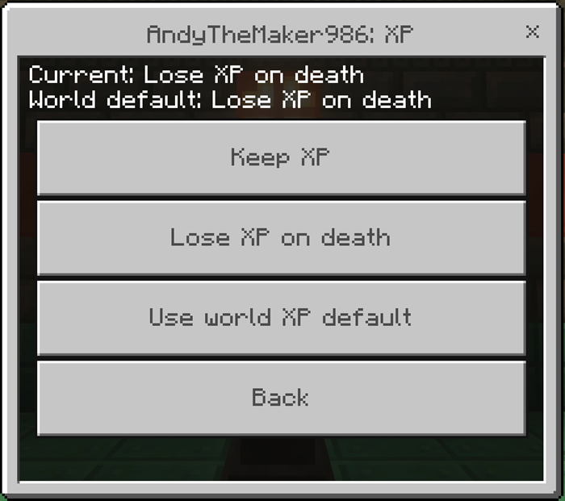
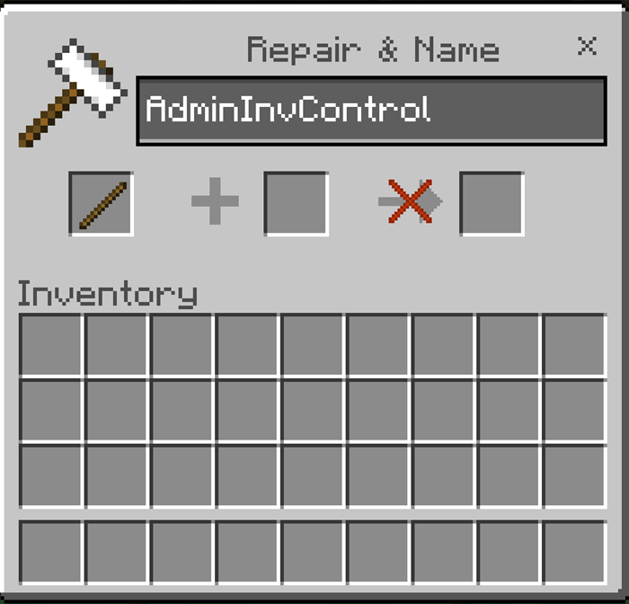
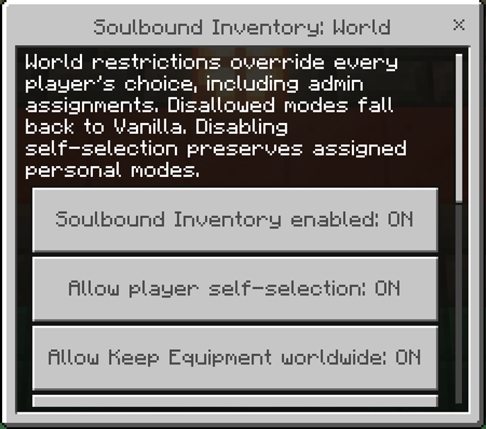
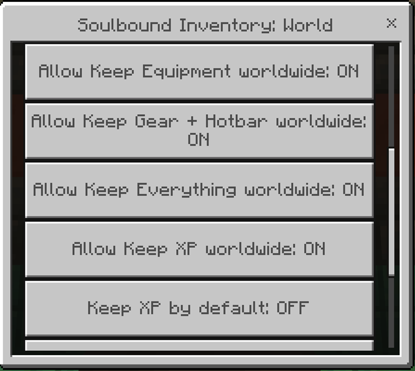
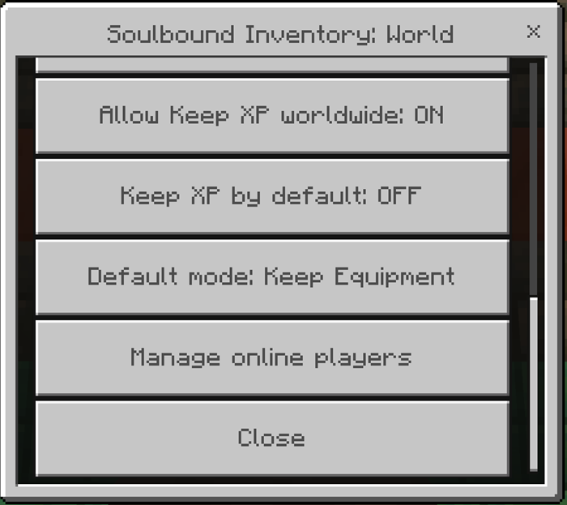
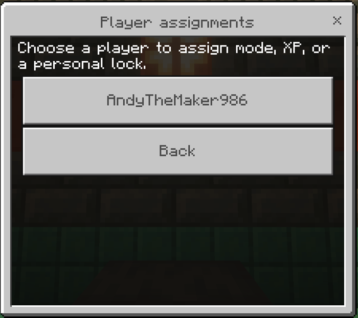

<p align="center"></p>

# Andy's Soulbound Inventory

**Per-player and selective Keep Inventory for Minecraft Bedrock.**

Keep your equipped gear, protect the whole hotbar, keep everything, or choose Vanilla. Each player can use a different death rule, with XP handled separately and clear world-owner controls.

Current version: **0.1.2**. The owner functional smoke test, Achievement Friendly, and Vibrant Visuals checks passed. Multiplayer and BDS remain unverified.

[Download Andy's Soulbound Inventory 0.1.2](Andys_Soulbound_Inventory_0.1.2.mcaddon)

<!-- SHA256 -->
SHA-256: `614296612258a9896cbf0e3bc5e119d441d6e3141058da5cec1fa15a86b63d2d`
<!-- /SHA256 -->

## Requirements

Minecraft Bedrock 26.30 or newer, both included packs, Standard graphics or Vibrant Visuals. Stable APIs; no experiments, Beta APIs, cheats, or other add-ons required. Both manifests carry the addon declaration used for achievement compatibility; the owner confirmed Achievement Friendly behavior and Vibrant Visuals compatibility.

## Features

- **Keep Equipment:** worn armor, offhand, and the currently selected hotbar item.
- **Keep Gear + Hotbar:** worn armor, offhand, and all nine hotbar slots.
- **Keep Everything** and **Vanilla** provide the two end points.
- Independent Keep XP or Vanilla XP, persistent per-player choices, world defaults and mode availability switches.
- Admin assignment, individual locks, global player-selection lock and dedicated-server console support.





## Installation and quick start

1. Open the downloaded mcaddon with Minecraft Bedrock.
2. Activate **Andy's Soulbound Inventory [BP]** on the world and confirm its linked Resource Pack.
3. Keep cheats and experiments off. New players start with Keep Equipment and Vanilla XP.
4. At an anvil, rename a stick exactly **PlayerInvControl**. Use it on a block, or sneak while holding it for one second.
5. World owners and operators use **AdminInvControl** for world settings and online player assignments.



For Realms, prepare and upload the world from Windows or mobile; console players can join that Realm. BDS operators install the two included packs into the server's pack folders and activate their UUIDs in the world's pack lists.

XP loss is applied just after respawn. Recoverable orbs are released once at the original death location only after the loss is verified. If that chunk is unloaded, the reward waits for it for up to five minutes from death; the XP loss still applies. Keep XP creates no extra orbs. Settings selected at death apply to that death.



## World and server controls

Admins can enable/disable the add-on, each retention mode and Keep XP worldwide, set defaults, and allow or lock player selection. Personal assignments persist. A globally disabled mode falls back to Vanilla; world restrictions always win. Mode switches control mode availability, not individual slot categories. A player lock can preserve a particular assignment while other players choose freely.











In the BDS console, use `asi:soulbound_help` and `asi:soulbound_status`. Examples:

```text
asi:soulbound_set defaultMode equipment
asi:soulbound_set allowEverything off
asi:soulbound_set allowPlayerChoice off
asi:soulbound_player "Player Name" mode hotbar
asi:soulbound_player "Player Name" keepXp on
asi:soulbound_player "Player Name" locked on
```

Other settings: `enabled`, `allowEquipment`, `allowHotbar`, `allowKeepXp`, `defaultKeepXp`. Modes: `vanilla`, `equipment`, `hotbar`, `everything`. Use `on`/`off` for booleans and `default` to clear a player's mode/XP override. Native commands support cheats-off worlds and require an operator or server console. Add `/` for in-game commands.

## Compatibility and important behavior

The system manages Keep Inventory internally and immediately drops only the slots excluded by each player's settings. Original item stacks remain intact. Native keep-on-death items remain protected; excluded vanishing items disappear. Spare equipment in the main inventory is ordinary inventory. XP loss releases seven points per previous level, capped at 100. Void losses are not recoverable.

**Before removing the packs, disable the add-on with AdminInvControl or `asi:soulbound_set enabled off`, then save.** This restores the world's prior Keep Inventory value. Removing packs cannot execute cleanup.

Single-player, multiplayer, Realms, BDS and all dimensions are intended targets. The owner confirmed the current feature set, Achievement Friendly behavior, and Vibrant Visuals compatibility in Bedrock. Multiplayer and BDS remain unverified because the owner cannot test them locally; removal and other compatibility checks remain open. Use one death inventory/XP manager per world. Andy's Soulbound Graves requires vanilla player death drops, so its Behavior Pack must not be active with Soulbound Inventory. Vanilla shields and other item textures are unchanged; cover artwork is illustrative.

## Troubleshooting and reporting problems

If a stick does not open its menu, check the exact name, close other screens, and try sneak-and-hold. Admin denial means the player lacks Operator permission. Unexpected Vanilla behavior can mean a world mode ban or lock. If too much inventory is retained, inspect the active mode, loaded version, and Content Log; a failed drop is restored to its slot.

Report version, platform, death cause, settings, other packs and relevant Content Log lines through the [CurseForge project page](https://www.curseforge.com/minecraft-bedrock/addons/andys-soulbound-inventory) or [AndyTheMakerMC.xyz](https://AndyTheMakerMC.xyz). Read the [player guide wiki](https://github.com/CharlesJGantt/Andys-Soulbound-Inventory/wiki) for setup and troubleshooting.

## Keep Exploring with Andy

**Andy's Soulbound Graves** offers the return-and-recover approach to death. Soulbound Inventory offers personal retention choices. Choose the approach that fits your world, and activate only one of their Behavior Packs in that world.

Explore [AndyTheMakerMC.xyz](https://AndyTheMakerMC.xyz), follow [@AndyTheMakerMC on YouTube](https://www.youtube.com/@AndyTheMakerMC), or support future work through [Ko-fi](https://ko-fi.com/andythemaker).

## Permissions and license

All Rights Reserved. Official unmodified releases may be used in personal worlds, multiplayer, Realms and servers, and showcased in original content including monetized videos. See [LICENSE.md](LICENSE.md). Minecraft is a trademark of Microsoft Corporation; this project is not affiliated with or endorsed by Microsoft or Mojang Studios.

